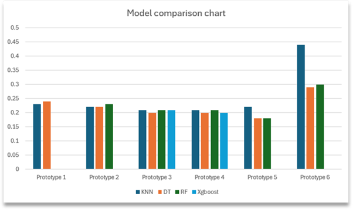

# ML-Dissertation-Project-Overview

The problems I aimed to achieve during this project were to address the lack of standardised terminology to define genres in the domain, the lack of large datasets being used for this type of project and a lack of research using machine learning (classification) in the domain. These problems were important to address because if the desired result was found then these findings could potentially apply to the medical field to assist people with various conditions. 

Tools
Language: Python
Key libraries: Scikit-learn, Pandas, Matplotlib
Enviroment: Google Colab

Data
The dataset was sourced from a collaboration study completed by The University of Oxford and Tilburg University. It contained over 11,000 participants with over 700,000 rows of data. 

Methodology
The data was already cleaned with the existing file. It did need to go through some pre-processing steps to tailor it more for the project. This included removing unrequired data, applying smote, dealing with null values via imputation and converting strings into integers. The data was tested by comparing the dependant variable to the independant variables. 

Key Challenges
During the earlier prototypes the KNN model seemed to be struggling greatly from the curse of dimentionality. To overcome this the catagories were grouped based on similarity, reducing the total catagories from 6 to 3. This greatly improved the models testing results, especially the KNN result. 
